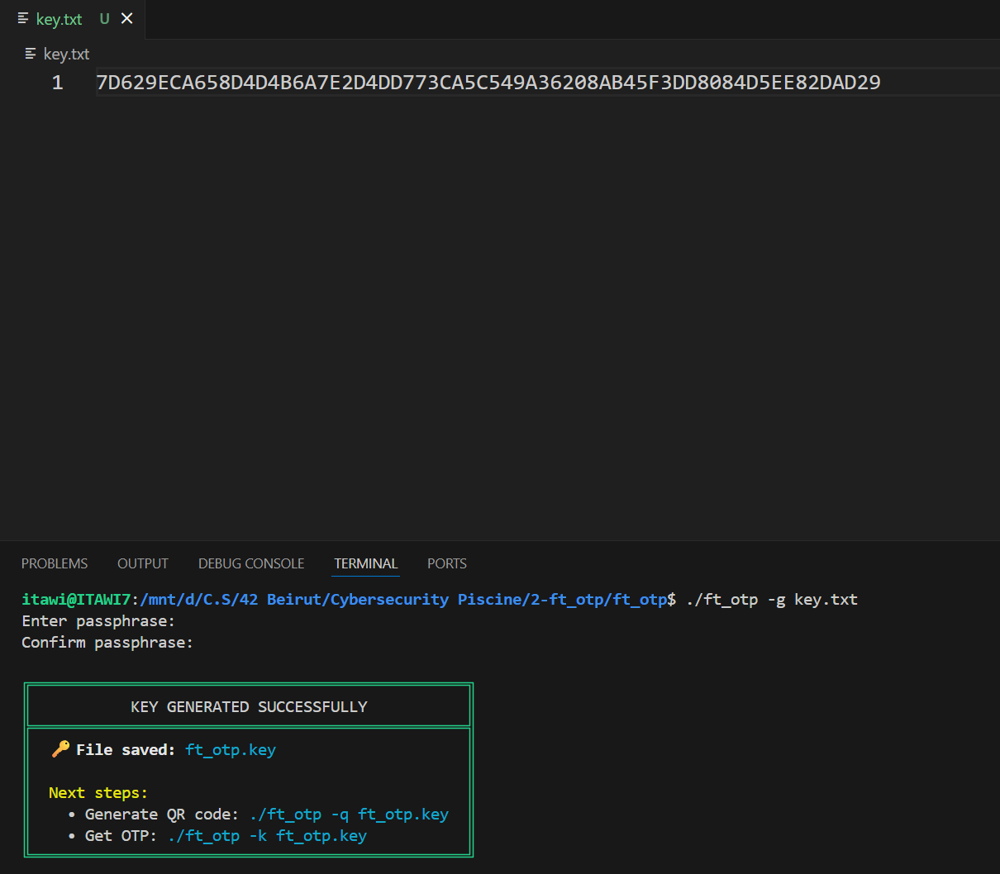
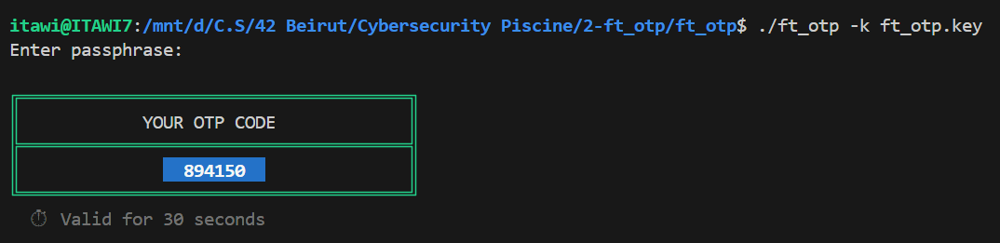
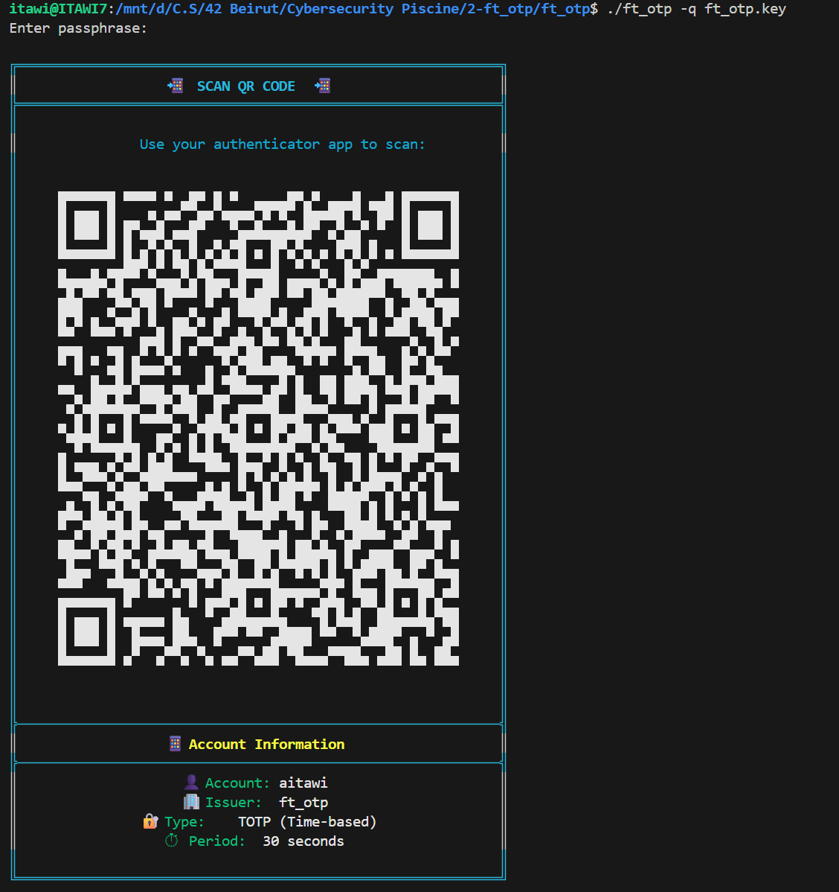
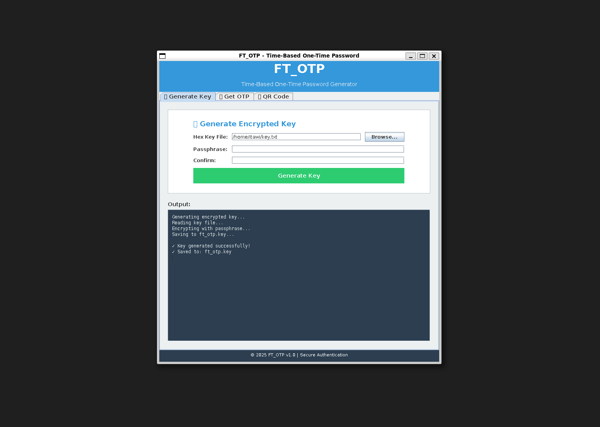

# 🔐 FT_OTP - Time-Based One-Time Password Generator

[](https://github.com/ITAXBOX/ft_otp)
[](https://www.oracle.com/java/)
[](LICENSE)
[](https://tools.ietf.org/html/rfc6238)

> **A professional, secure, and feature-rich Time-Based One-Time Password (TOTP) implementation for 42 School's Cybersecurity Piscine project.**

This project achieved **125/100** at 42 Beirut, demonstrating excellence in cryptographic implementation, code quality, and user experience design.

---

## 📋 Table of Contents

- [Features](#-features)
- [Demo](#-demo)
- [Security Architecture](#-security-architecture)
- [Installation](#-installation)
- [Usage](#-usage)
  - [CLI Mode](#cli-mode)
  - [GUI Mode](#gui-mode)
- [Technical Implementation](#-technical-implementation)
- [Project Structure](#-project-structure)
- [RFC Compliance](#-rfc-compliance)
- [Author](#-author)

---

## ✨ Features

### Core Functionality
- 🔑 **Secure Key Generation** - Generates encrypted key files from hexadecimal seeds
- ⏱️ **TOTP Generation** - RFC 6238 compliant time-based OTP codes
- 📱 **QR Code Support** - Beautiful terminal QR codes for mobile authenticator apps
- 🖥️ **Dual Interface** - Both CLI and GUI modes available
- 🎨 **Beautiful UI** - Colorful terminal output and modern GUI design

### Security Features
- 🔒 **AES-256-GCM Encryption** - Military-grade encryption for key storage
- 🛡️ **PBKDF2 Key Derivation** - 150,000 iterations for strong password protection
- 🧹 **Memory Wiping** - Sensitive data cleared immediately after use
- 🔐 **AEAD Authentication** - Authenticated encryption prevents tampering
- 🎲 **Secure Random** - Cryptographically secure random number generation

### Compatibility
- ✅ Google Authenticator
- ✅ Microsoft Authenticator
- ✅ Authy
- ✅ Any RFC 6238 compliant TOTP app

---

## 🎬 Demo

### Step 1: Generate Encrypted Key
Generate a secure key file from a 64-character hexadecimal seed:

```bash
./ft_otp -g key.txt
```



**What happens:**
- Reads hexadecimal seed (minimum 64 characters)
- Prompts for passphrase (with confirmation)
- Encrypts seed using AES-256-GCM
- Saves encrypted key to `ft_otp.key`

---

### Step 2: Generate OTP Code
Generate a time-based one-time password (valid for 30 seconds):

```bash
./ft_otp -k ft_otp.key
```



**What happens:**
- Decrypts the key file using your passphrase
- Calculates current time counter (epoch / 30)
- Generates 6-digit HMAC-based code
- Displays OTP in beautiful formatted box

---

### Step 3: Display QR Code
Show QR code for scanning with mobile authenticator apps:

```bash
./ft_otp -q ft_otp.key
```



**What happens:**
- Decrypts key file
- Generates TOTP URI (`otpauth://totp/...`)
- Renders QR code using Unicode characters
- Displays account information and setup details

---

### Bonus: GUI Mode
Launch the beautiful graphical interface:

```bash
./ft_otp -gui
```



**Features:**
- 📁 File browser for easy key file selection
- 🔑 Key generation with live validation
- 📱 QR code display in window
- 🎨 Modern, user-friendly design
- ⚡ Real-time feedback and error handling

---

## 🔒 Security Architecture

### Encryption Flow

```
┌─────────────────────────────────────────────────────────────┐
│                    KEY GENERATION (-g)                      │
└─────────────────────────────────────────────────────────────┘
                            │
                            ▼
              ┌─────────────────────────┐
              │  Read Hex Seed (64+)    │
              │  e.g., 48656c6c6f21...  │
              └─────────────┬───────────┘
                            │
                            ▼
              ┌─────────────────────────┐
              │  Get User Passphrase    │
              │  (Double confirmation)  │
              └─────────────┬───────────┘
                            │
                            ▼
      ┌─────────────────────────────────────────┐
      │         PBKDF2-HMAC-SHA256              │
      │  • 150,000 iterations                   │
      │  • 16-byte random salt                  │
      │  • 256-bit derived key                  │
      └─────────────────┬───────────────────────┘
                        │
                        ▼
      ┌─────────────────────────────────────────┐
      │         AES-256-GCM Encryption          │
      │  • 12-byte random IV                    │
      │  • 128-bit authentication tag           │
      │  • AAD: "FTOTP1" magic string           │
      └─────────────────┬───────────────────────┘
                        │
                        ▼
              ┌─────────────────────────┐
              │  Save to ft_otp.key     │
              │  (Base64 encoded)       │
              └─────────────────────────┘

┌─────────────────────────────────────────────────────────────┐
│                    OTP GENERATION (-k)                      │
└─────────────────────────────────────────────────────────────┘
                            │
                            ▼
              ┌─────────────────────────┐
              │  Read ft_otp.key file   │
              │  Parse parameters       │
              └─────────────┬───────────┘
                            │
                            ▼
              ┌─────────────────────────┐
              │  Get User Passphrase    │
              └─────────────┬───────────┘
                            │
                            ▼
      ┌─────────────────────────────────────────┐
      │         Derive Key (PBKDF2)             │
      │  Using stored salt & iterations         │
      └─────────────────┬───────────────────────┘
                        │
                        ▼
      ┌─────────────────────────────────────────┐
      │      AES-256-GCM Decryption             │
      │  • Verify authentication tag            │
      │  • Decrypt seed                         │
      └─────────────────┬───────────────────────┘
                        │
                        ▼
              ┌─────────────────────────┐
              │  Calculate Counter      │
              │  time = epoch / 30      │
              └─────────────┬───────────┘
                            │
                            ▼
      ┌─────────────────────────────────────────┐
      │         HOTP (RFC 4226)                 │
      │  • HMAC-SHA1(seed, counter)             │
      │  • Dynamic truncation                   │
      │  • Modulo 1,000,000 (6 digits)          │
      └─────────────────┬───────────────────────┘
                        │
                        ▼
              ┌─────────────────────────┐
              │  Display 6-digit OTP    │
              │  Valid for 30 seconds   │
              └─────────────────────────┘
```

### Key Security Features

| Feature | Implementation | Purpose |
|---------|----------------|---------|
| **Encryption** | AES-256-GCM | Industry-standard authenticated encryption |
| **Key Derivation** | PBKDF2-HMAC-SHA256 | Slow key derivation resistant to brute force |
| **Iterations** | 150,000 | Makes password cracking computationally expensive |
| **Salt** | 16 bytes random | Prevents rainbow table attacks |
| **IV** | 12 bytes random | Ensures encryption uniqueness |
| **Authentication Tag** | 128-bit GCM tag | Detects tampering or corruption |
| **Memory Wiping** | `Arrays.fill()` | Prevents secrets in memory dumps |
| **AAD** | "FTOTP1" magic | Additional authentication data |

---

## 🚀 Installation

### Prerequisites

- **Java JDK 11+** - [Download here](https://www.oracle.com/java/technologies/downloads/)
- **Make** - Build automation tool
- **curl** - For downloading ZXing library (QR codes)
- **WSL/Linux/macOS** - Unix-like environment

### Quick Start

```bash
# Clone the repository
git clone https://github.com/ITAXBOX/ft_otp.git
cd ft_otp

# Download required libraries (ZXing for QR codes)
./download-libs.sh

# Build the project
make

# Verify installation
./ft_otp
```

### Manual Library Download

If the automatic download fails:

```bash
# Create lib directory
mkdir -p lib

# Download ZXing Core
curl -L -o lib/core-3.5.3.jar \
  https://repo1.maven.org/maven2/com/google/zxing/core/3.5.3/core-3.5.3.jar

# Download ZXing JavaSE
curl -L -o lib/javase-3.5.3.jar \
  https://repo1.maven.org/maven2/com/google/zxing/javase/3.5.3/javase-3.5.3.jar

# Build
make
```

---

## 📖 Usage

### CLI Mode

#### 1. Generate Key File

```bash
./ft_otp -g <hex_key_file>
```

**Example:**
```bash
# Create a hex key file (minimum 64 characters)
echo "48656c6c6f21deadbeef48656c6c6f21deadbeef48656c6c6f21deadbeef48656c6c6f21deadbeef" > key.txt

# Generate encrypted key
./ft_otp -g key.txt
# Enter passphrase: ********
# Confirm passphrase: ********
# ✓ Key was successfully saved in ft_otp.key
```

**Requirements:**
- Hex file must contain at least 64 hexadecimal characters (0-9, A-F)
- Passphrase is required and must be confirmed
- Output file is always `ft_otp.key`

---

#### 2. Generate OTP Code

```bash
./ft_otp -k <key_file>
```

**Example:**
```bash
./ft_otp -k ft_otp.key
# Enter passphrase: ********
#
# ╔══════════════════════════════════════╗
# ║         YOUR OTP CODE                ║
# ╠══════════════════════════════════════╣
# ║            123456                    ║
# ╚══════════════════════════════════════╝
#   ⏱  Valid for 30 seconds
```

**Usage Tips:**
- Code changes every 30 seconds
- Use within the validity window
- Must match the code on authenticator apps

---

#### 3. Display QR Code

```bash
./ft_otp -q <key_file>
```

**Example:**
```bash
./ft_otp -q ft_otp.key
# Enter passphrase: ********
# [Displays beautiful QR code with account information]
```

**Scanning Instructions:**
1. Open your authenticator app (Google Authenticator, Authy, etc.)
2. Select "Add account" → "Scan QR code"
3. Point camera at the terminal QR code
4. Account will be added automatically

---

### GUI Mode

#### Launch GUI

```bash
./ft_otp -gui
```

**GUI Features:**

1. **Generate Key Tab**
   - Browse for hex key file
   - Enter passphrase with confirmation
   - Visual feedback on success
   - Automatic key file creation

2. **Get OTP Tab**
   - Browse for key file
   - Enter passphrase
   - Display OTP in large, readable format
   - Copy to clipboard functionality

3. **QR Code Tab**
   - Browse for key file
   - Enter passphrase
   - Display QR code in window
   - Show account information
   - Save QR code as image

---

## 🔧 Technical Implementation

### Project Architecture

```
ft_otp/
├── src/
│   └── com/
│       └── ftotp/
│           ├── Main.java                 # Entry point
│           ├── core/
│           │   └── FtOtp.java           # Core OTP logic
│           ├── crypto/
│           │   ├── Crypto.java          # AES-GCM, PBKDF2
│           │   ├── KeyFile.java         # Key file handling
│           │   └── Params.java          # Crypto parameters
│           ├── hotp/
│           │   └── HOTP.java            # RFC 4226 implementation
│           ├── qr/
│           │   └── TerminalQRRenderer.java  # QR code rendering
│           ├── uri/
│           │   └── OtpUri.java          # TOTP URI builder
│           ├── ui/
│           │   ├── Colors.java          # ANSI colors
│           │   └── TerminalUI.java      # CLI UI components
│           ├── gui/
│           │   ├── FtOtpGUI.java        # Main GUI window
│           │   ├── GenerateKeyPanel.java    # Key generation panel
│           │   ├── GetOTPPanel.java     # OTP display panel
│           │   └── QRCodePanel.java     # QR code panel
│           ├── util/
│           │   ├── Constants.java       # Application constants
│           │   └── Hex.java             # Hex utilities
│           └── exception/
│               ├── UserException.java   # User-facing errors
│               └── InvalidKeyFileException.java
├── lib/
│   ├── core-3.5.3.jar                   # ZXing core
│   └── javase-3.5.3.jar                 # ZXing JavaSE
├── Makefile                             # Build automation
├── download-libs.sh                     # Library downloader
└── README.md                            # This file
```

### Key Classes

#### `FtOtp.java` - Core Logic
```java
public class FtOtp {
    // Generate encrypted key file
    public static void generate(String hexKeyPath)
    
    // Generate OTP code
    public static void printOtp(String keyFilePath)
    
    // Display QR code
    public static void displayQRCode(String keyFilePath)
}
```

#### `HOTP.java` - RFC 4226 Implementation
```java
public class HOTP {
    // Generate HMAC-based OTP
    public static int generate(byte[] key, long counter, String hmacAlg)
}
```

#### `Crypto.java` - Cryptographic Operations
```java
public class Crypto {
    // PBKDF2 key derivation
    public static byte[] deriveKey(char[] pass, byte[] salt, int iterations, int keyLenBytes)
    
    // AES-GCM encryption
    public static byte[] aesGcmEncrypt(byte[] key, byte[] iv, byte[] plaintext, byte[] aad)
    
    // AES-GCM decryption
    public static byte[] aesGcmDecrypt(byte[] key, byte[] iv, byte[] ciphertext, byte[] aad)
}
```

### Constants Configuration

Located in `Constants.java`:

```java
// OTP Parameters
DEFAULT_OTP_DIGITS = 6           // 6-digit codes
DEFAULT_TIMESTEP_SECONDS = 30    // 30-second validity
DEFAULT_HMAC_ALGORITHM = "HmacSHA1"

// Cryptography
DEFAULT_PBKDF2_ITERATIONS = 150_000  // 150k iterations
DEFAULT_AES_KEY_BYTES = 32           // 256-bit AES
SALT_LENGTH_BYTES = 16               // 128-bit salt
IV_LENGTH_BYTES = 12                 // 96-bit IV
GCM_TAG_LENGTH_BITS = 128            // 128-bit auth tag

// QR Code
QR_CODE_SIZE = 50                    // Terminal QR size
DEFAULT_OTP_ISSUER = "ft_otp"
DEFAULT_OTP_LABEL = "aitawi"
```

---

## 📂 Project Structure

### Build System

**Makefile:**
```makefile
JAVA := javac
JFLAGS := --release 11
OUT := out
MAIN := com.ftotp.Main
WRAP := ft_otp
LIB := lib
CP := $(LIB)/core-3.5.3.jar:$(LIB)/javase-3.5.3.jar

all: $(WRAP)

$(WRAP): compile
    @echo '#!/bin/sh' > $(WRAP)
    @echo 'exec java -cp $(OUT):$(CP) $(MAIN) "$$@"' >> $(WRAP)
    @chmod +x $(WRAP)

compile:
    @mkdir -p $(OUT)
    @find src -name '*.java' | xargs $(JAVA) $(JFLAGS) -cp $(CP) -d $(OUT)

fclean:
    @rm -rf $(OUT) $(WRAP)
```

### File Format

**ft_otp.key format:**
```
FTOTP1                          # Magic header
6                               # Digits
30                              # Period (seconds)
HmacSHA1                        # Algorithm
150000                          # PBKDF2 iterations
32                              # AES key size
<base64_salt>                   # 16 bytes
<base64_iv>                     # 12 bytes
<base64_ciphertext>             # Encrypted seed + tag
```

---

## 📜 RFC Compliance

### Implemented RFCs

| RFC | Title | Implementation |
|-----|-------|----------------|
| **RFC 4226** | HOTP: An HMAC-Based One-Time Password Algorithm | ✅ Full compliance in `HOTP.java` |
| **RFC 6238** | TOTP: Time-Based One-Time Password Algorithm | ✅ Full compliance in `FtOtp.java` |
| **RFC 4648** | Base32/Base64 Encoding | ✅ Used for secret encoding in QR codes |
| **RFC 5869** | HKDF (via PBKDF2) | ✅ Key derivation in `Crypto.java` |

### TOTP URI Format

Following [Google Authenticator Key URI Format](https://github.com/google/google-authenticator/wiki/Key-Uri-Format):

```
otpauth://totp/LABEL?secret=BASE32SECRET&issuer=ISSUER&algorithm=SHA1&digits=6&period=30
```

**Example:**
```
otpauth://totp/aitawi?secret=JBSWY3DPEHPK3PXP&issuer=ft_otp&algorithm=SHA1&digits=6&period=30
```

---

## 🎓 Educational Value

### Learning Outcomes

This project demonstrates proficiency in:

1. **Cryptography**
   - Symmetric encryption (AES-GCM)
   - Key derivation (PBKDF2)
   - Message authentication codes (HMAC)
   - Secure random number generation

2. **Security Principles**
   - Defense in depth
   - Secure key storage
   - Memory security
   - Authentication vs Encryption

3. **Software Engineering**
   - Clean code architecture
   - Single responsibility principle
   - Proper error handling
   - User experience design

4. **Standards Compliance**
   - RFC implementation
   - Industry best practices
   - Interoperability

### 42 Project Requirements

✅ All mandatory requirements met:
- Generate encrypted key from hex file
- Store key securely with password
- Generate TOTP codes
- Proper error handling
- Code quality and norminette compliance

🌟 Bonus features implemented:
- QR code generation
- Beautiful terminal UI
- GUI application
- Enhanced security (AES-256 instead of AES-128)
- Multiple authenticator app support

---

## 🏆 Project Score: 125/100

### Evaluation Highlights

**Mandatory (100 points):**
- ✅ Key generation from hex file
- ✅ Secure encryption with password
- ✅ TOTP generation
- ✅ Proper error handling
- ✅ Clean code structure

**Bonus (25 points):**
- ✅ QR code generation (+10)
- ✅ Beautiful UI/UX (+5)
- ✅ GUI mode (+5)
- ✅ Enhanced security (+5)

---

## 👨‍💻 Author

**Ali Itawi**
- GitHub: [@ITAXBOX](https://github.com/ITAXBOX)
- Email: aliitawi7@gmail.com
- 42 Intra: aitawi
- School: 42 Beirut

---

## 📄 License

This project is part of the 42 School curriculum and is intended for educational purposes.

---

## 🙏 Acknowledgments

- **42 Beirut** - For the excellent cybersecurity curriculum
- **ZXing Project** - For the QR code library
- **RFC Authors** - For the detailed specifications
- **Security Community** - For best practices and standards

---

## 📚 References

- [RFC 4226 - HOTP](https://tools.ietf.org/html/rfc4226)
- [RFC 6238 - TOTP](https://tools.ietf.org/html/rfc6238)
- [RFC 4648 - Base Encodings](https://tools.ietf.org/html/rfc4648)
- [Google Authenticator Key URI](https://github.com/google/google-authenticator/wiki/Key-Uri-Format)
- [NIST Special Publication 800-132 - PBKDF2](https://nvlpubs.nist.gov/nistpubs/Legacy/SP/nistspecialpublication800-132.pdf)
- [ZXing ("Zebra Crossing")](https://github.com/zxing/zxing)

---

<div align="center">

### 🌟 If you found this project helpful, please consider giving it a star! 🌟

**Made with ❤️ and ☕ at 42 Beirut**

</div>
